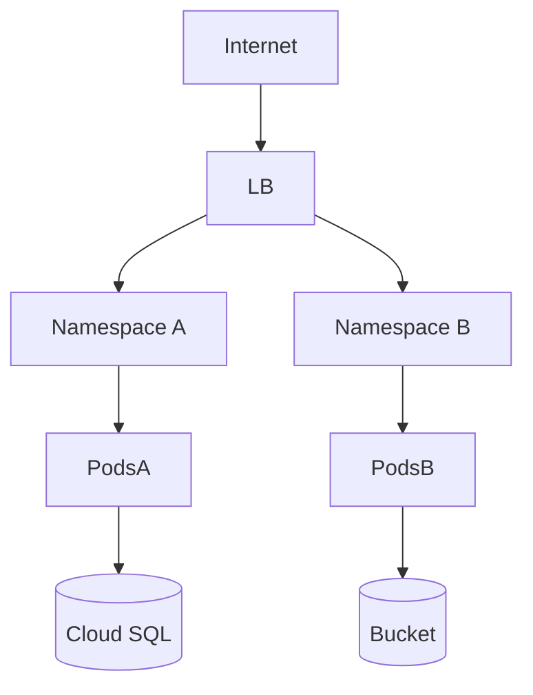

# Cloud Architecture

This document describes the cloud-specific architecture.

## Cloud Topology

## Key Components

- Regions / Zones:
- Networking:
- Load Balancers:
- Compute (Kubernetes / Cloud Run / VMs):
- Storage Services:
- IAM / Permissions:
