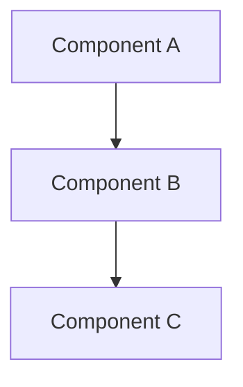

# Architecture Documentation

## System Overview

[Brief 2-3 sentence description of the system - what it does, who uses it, key characteristics]

## Documentation Structure

This directory contains the following architecture documentation:

- **[System Overview](system-overview.md)** - High-level system architecture and components
- **[Cloud Architecture](cloud-architecture.md)** - Cloud infrastructure and deployment topology
- **[Service Architecture](service-architecture.md)** - Internal services, APIs, and data flows
- **[CI/CD Architecture](cicd-architecture.md)** - Build, test, and deployment processes

## Quick Reference

[Replace with a simple diagram showing the main system components and their relationships]

## Key Technologies

- **Language/Framework**: [e.g., Python/FastAPI, Node.js/Express, etc.]
- **Database**: [e.g., PostgreSQL, MongoDB, etc.]
- **Infrastructure**: [e.g., AWS, GCP, Kubernetes, etc.]
- **Key Dependencies**: [List 3-5 most important libraries/services]

## Getting Started

For developers new to this system:

1. Start with [System Overview](system-overview.md) for the big picture
2. Review [Service Architecture](service-architecture.md) to understand internal components
3. See [Cloud Architecture](cloud-architecture.md) for deployment details
4. Check [CI/CD Architecture](cicd-architecture.md) for build and deployment processes

---

**Last Updated**: [Date] | **Maintained By**: [Team/Person]
