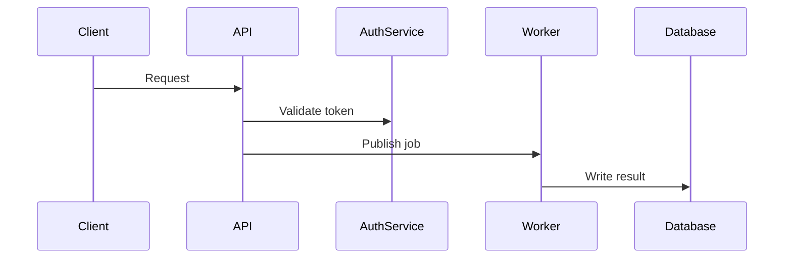

# Service Architecture

This document outlines internal services and interactions.

## Service Relationships

```mermaid
sequenceDiagram
    Client->>API: Request
    API->>AuthService: Validate token
    API->>Worker: Publish job
    Worker->>Database: Write result
```

## Services
- API:
- Worker:
- Supporting Services:
- Event Systems:
- Data Models:
