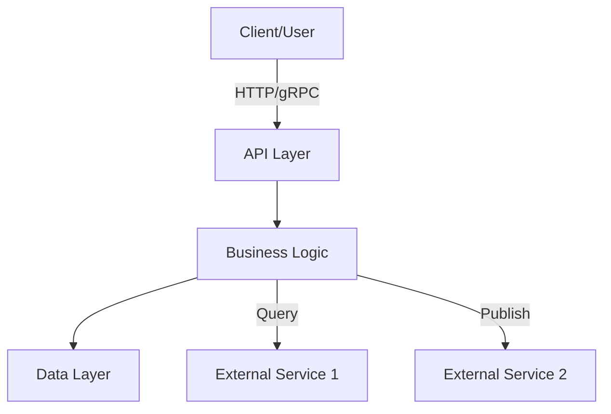

# [App Name]

> **Template Usage**: This template can be used as:
>
> - `docs/{app-name}.md` for single app repositories
> - `docs/apps/{app-name}/README.md` for repositories with multiple apps
> - `docs/services/{service-name}/README.md` for service-oriented repositories
>
> Adapt sections as needed for your specific app type.

## Overview

Brief description of what this app/service does and its primary responsibilities within the system. Include who uses it and what problem it solves.

## Architecture



## Technology Stack

- **Language/Runtime**: [e.g., Go 1.20, Node.js 18, Python 3.11]
- **Framework**: [e.g., Echo, Express, FastAPI]
- **Database**: [e.g., PostgreSQL, MongoDB, Redis]
- **Key Dependencies**: [List major libraries or services]

## Key Responsibilities

- **Responsibility 1**: Brief description
- **Responsibility 2**: Brief description
- **Responsibility 3**: Brief description

## Dependencies & Integrations

### External Services

- **Service A**: Used for [purpose]. Sync/Async via [mechanism].
- **Service B**: Used for [purpose]. Sync/Async via [mechanism].

### Data Sources

- **Database**: [Description of what data is stored]
- **Message Queue**: [If applicable, e.g., Kafka, RabbitMQ]

## Running Locally

### Prerequisites

- [List requirements, e.g., Go 1.20+, PostgreSQL 14+]

### Setup

```bash
# Clone and navigate
git clone <repo-url>
cd <repo-path>

# Install dependencies
# [Insert language-specific install command]

# Configure environment
cp .env.example .env
# Edit .env with local settings

# Run
# [Insert language-specific run command]
```

### Environment Variables

- `ENV_VAR_1`: Description of what this controls
- `ENV_VAR_2`: Description of what this controls

## Deployment

- **Environment**: [e.g., Kubernetes, Docker Compose, Serverless]
- **Configuration**: [Link to deployment docs, e.g., `docs/cicd-architecture.md`]
- **Health Check**: [Endpoint or mechanism used to verify service is healthy]

## Documentation

- **API Documentation**: [Link to OpenAPI/Swagger, if applicable]
- **Architecture**: [Links to system-wide architecture docs]
- **Contributing**: [Link to contribution guidelines if they exist]

## Notes

- [Any operational notes, known limitations, or important context for developers]
- [Links to related issues, architecture decisions, or RFCs]
