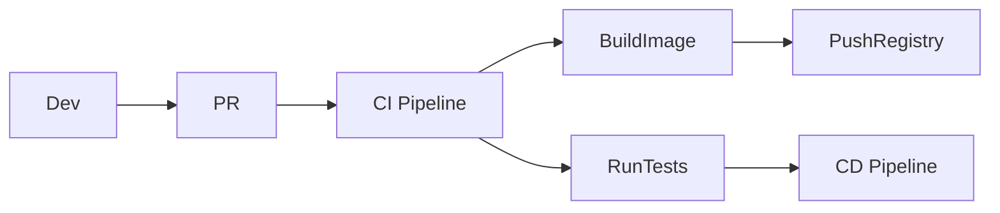

````markdown
# CI/CD Architecture

This document describes how code moves from development to production.

## Pipeline Overview



## Details

- Branching strategy:
- CI steps:
- Test strategy:
- Artifact creation:
- Deployment flow:
- GitOps / Automation:

````
