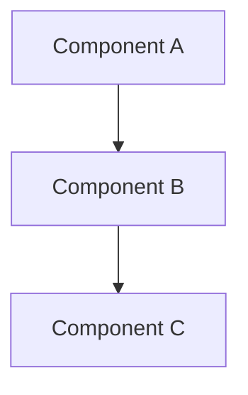

````markdown
# Repository Documentation

## Repository Overview

[Brief 2-3 sentence description of the repository - what it contains, who uses it, key characteristics]

## Documentation Structure

This directory contains the following documentation templates:

- **[System Overview](system-overview.md)** - High-level system architecture and components
- **[Cloud Architecture](cloud-architecture.md)** - Cloud infrastructure and deployment topology
- **[Service Architecture](service-architecture.md)** - Internal services, APIs, and data flows
- **[CI/CD Architecture](cicd-architecture.md)**n+
 - **[Usage](usage.md)** - Usage guidelines and quick start
## Quick Reference



## Key Technologies

- **Language/Framework**: [e.g., Python/FastAPI, Node.js/Express, etc.]
- **Database**: [e.g., PostgreSQL, MongoDB, etc.]
- **Infrastructure**: [e.g., AWS, GCP, Kubernetes, etc.]

---

**Last Updated**: [Date] | **Maintained By**: [Team/Person]

````
